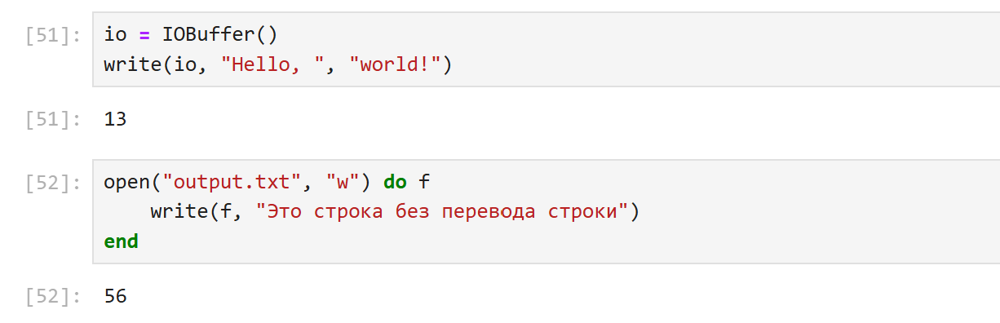

---
## Front matter
lang: ru-RU
title: Лабораторная работа № 1
subtitle: Знакомство с основами синтаксиса Julia
author:
  - Доберштейн А. С.
institute:
  - Российский университет дружбы народов, Москва, Россия

## i18n babel
babel-lang: russian
babel-otherlangs: english

## Formatting pdf
toc: false
toc-title: Содержание
slide_level: 2
aspectratio: 169
section-titles: true
theme: metropolis
header-includes:
 - \usetheme{metropolis}
 - \usepackage{fontspec}
 - \usepackage{polyglossia}
 - \setdefaultlanguage{russian}
 - \setmainfont{FreeSerif}
 - \setsansfont{FreeSerif}
 - \setmonofont{FreeSerif}
 - \usepackage{amsmath}
 - \usepackage{amssymb}
---

# Информация

## Докладчик

:::::::::::::: {.columns align=center}
::: {.column width="70%"}

  * Доберштейн Алина Сергеевна
  * НФИбд-02-22
  * Российский университет дружбы народов
  * [1132226448@pfur.ru](mailto:1132226448@pfur.ru)

:::

::::::::::::::

## Цель работы

Основная цель работы — подготовить рабочее пространство и инструментарий для работы с языком программирования Julia, на простейших примерах познакомиться с основами синтаксиса Julia.

## Задание

1. Установите под свою операционную систему Julia, Jupyter.
2. Используя Jupyter Lab, повторите примеры из раздела лабораторной работы.
3. Выполните задания для самостоятельной работы.

# Выполнение лабораторной работы

{#fig:001 width=70%}

## Простейшие операции на языке Julia

Повторила простейшие примеры для знакомства с синтаксисом Julia из лабораторной работы.

{#fig:002 width=70%}

## Простейшие операции на языке Julia

{#fig:003 width=70%}

## Простейшие операции на языке Julia

{#fig:004 width=70%}

## Простейшие операции на языке Julia

{#fig:005 width=70%}

## Простейшие операции на языке Julia

{#fig:006 width=70%}

## Простейшие операции на языке Julia

{#fig:007 width=70%}

## Простейшие операции на языке Julia

{#fig:008 width=70%}

## Основные функции Julia

{#fig:009 width=70%}

## Основные функции Julia

Функция `read()` читает содержимое файла или потока целиком в виде массива байт или другого типа, если его задать. Читает содержимое в одну строку, без переноса, с разделителями.

{#fig:010 width=70%}

## Основные функции Julia

{#fig:011 width=70%}

## Основные функции Julia

Эта функция читает одну строку из файла или потока. При достижении конца файла выбрасывает исключение.

{#fig:012 width=70%}

## Основные функции Julia

Эта функция читает все строки из файла и возвращает массив строк.

{#fig:013 width=70%}

## Основные функции Julia

Эта функция читает данные из файла с разделителями (delimiter), например CSV или табличные данные. Возвращает матрицу или массив.

{#fig:014 width=70%}

## Основные функции Julia

{#fig:015 width=70%}

## Основные функции Julia

Функция `print()` выводит данные на экран без перевода строки. A `println()` - с переводом в конце строки.

{#fig:016 width=70%}

## Основные функции Julia

{#fig:017 width=70%}

## Основные функции Julia

Эта функция выводит данные в более "сыром" или структурированном виде. Часто используется для вывода объектов с отображением их внутреннего представления.

{#fig:018 width=70%}

## Основные функции Julia

{#fig:019 width=70%}

## Основные функции Julia

Эта функция записывает байты или данные в файл или поток, не добавляет перевод строки, не форматирует данные.

{#fig:020 width=70%}

{#fig:021 width=70%}

## Функция parse()

{#fig:022 width=70%}

## Функция parse()

Функция `parse()` в Julia используется для преобразования строки (String) в значение указанного типа. Это удобно, когда нужно конвертировать текстовые данные в числа, логические значения и другие типы.

{#fig:023 width=70%}

## Базовые математические операции

{#fig:024 width=70%}

## Базовые математические операции

{#fig:025 width=70%}

## Базовые математические операции

{#fig:026 width=70%}

## Базовые математические операции

{#fig:027 width=70%}

## Базовые математические операции

{#fig:028 width=70%}

## Базовые математические операции

{#fig:029 width=70%}

## Базовые математические операции

{#fig:030 width=70%}

## Базовые математические операции

{#fig:031 width=70%}

## Базовые математические операции

{#fig:032 width=70%}

## Операции над матрицами и векторами

{#fig:033 width=70%}

## Операции над матрицами и векторами

{#fig:034 width=70%}

## Операции над матрицами и векторами

{#fig:035 width=70%}

## Операции над матрицами и векторами

{#fig:036 width=70%}

## Операции над матрицами и векторами

{#fig:037 width=70%}

## Операции над матрицами и векторами

{#fig:038 width=70%}

## Операции над матрицами и векторами

{#fig:039 width=70%}

## Выводы

В результате выполнения данной лабораторной работы я подготовила рабочее пространство и инструментарий для работы с языком программирования Julia, на простейших примерах познакомилась с основами синтаксиса Julia

## Список литературы

1. JuliaLang [Электронный ресурс]. 2024 JuliaLang.org contributors. URL: https://julialang.org/ (дата обращения: 11.10.2024).
2. Julia 1.11 Documentation [Электронный ресурс]. 2024 JuliaLang.org contributors. URL: https://docs.julialang.org/en/v1/ (дата обращения: 11.10.2024).