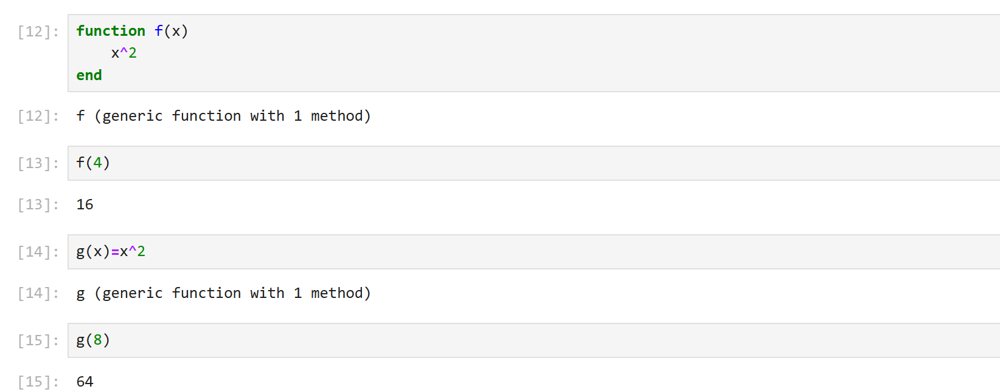
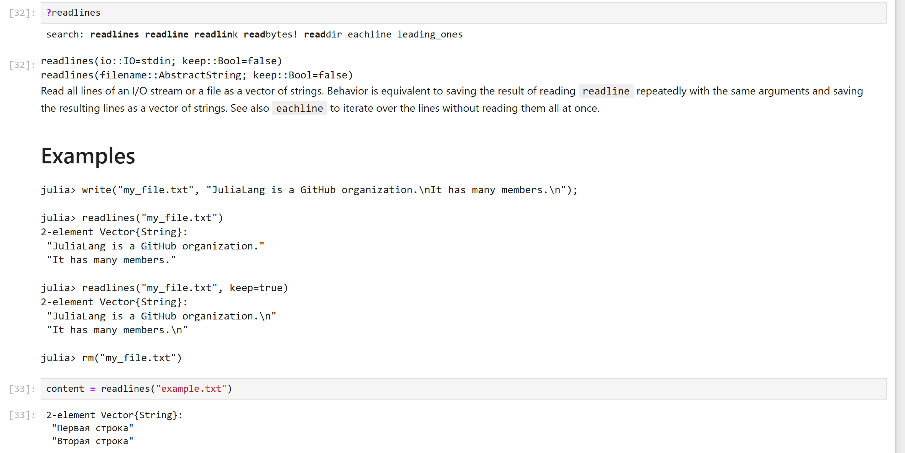

---
## Front matter
title: "Лабораторная работа №1"
subtitle: " Julia. Установка и настройка. Основные принципы."
author: "Доберштейн Алина Сергеевна"

## Generic otions
lang: ru-RU
toc-title: "Содержание"

## Bibliography
bibliography: bib/cite.bib
csl: pandoc/csl/gost-r-7-0-5-2008-numeric.csl

## Pdf output format
toc: true # Table of contents
toc-depth: 2
lof: true # List of figures
lot: false # List of tables
fontsize: 12pt
linestretch: 1.5
papersize: a4
documentclass: scrreprt
## I18n polyglossia
polyglossia-lang:
  name: russian
  options:
	- spelling=modern
	- babelshorthands=true
polyglossia-otherlangs:
  name: english
## I18n babel
babel-lang: russian
babel-otherlangs: english
## Fonts
mainfont: FreeSerif
romanfont: FreeSerif
sansfont: FreeSerif
monofont: FreeSerif

mainfontoptions: Ligatures=Common,Ligatures=TeX,Scale=0.94
romanfontoptions: Ligatures=Common,Ligatures=TeX,Scale=0.94
sansfontoptions: Ligatures=Common,Ligatures=TeX,Scale=MatchLowercase,Scale=0.94
monofontoptions: Scale=MatchLowercase,Scale=0.94,FakeStretch=0.9
mathfontoptions:
## Biblatex
biblatex: true
biblio-style: "gost-numeric"
biblatexoptions:
  - parentracker=true
  - backend=biber
  - hyperref=auto
  - language=auto
  - autolang=other*
  - citestyle=gost-numeric
## Pandoc-crossref LaTeX customization
figureTitle: "Рис."
tableTitle: "Таблица"
listingTitle: "Листинг"
lofTitle: "Список иллюстраций"
lotTitle: "Список таблиц"
lolTitle: "Листинги"
## Misc options
indent: true
header-includes:
  - \usepackage{indentfirst}
  - \usepackage{unicode-math}
  - \usepackage{float} # keep figures where there are in the text
  - \floatplacement{figure}{H} # keep figures where there are in the text
---

# Цель работы

Основная цель работы — подготовить рабочее пространство и инструментарий для работы с языком программирования Julia, на простейших примерах познакомиться с основами синтаксиса Julia.

# Задание

1. Установите под свою операционную систему Julia, Jupyter.
2. Используя Jupyter Lab, повторите примеры из раздела лабораторной работы.
3. Выполните задания для самостоятельной работы.

# Теоретическое введение

Julia -- высокоуровневый свободный язык программирования с динамической типизацией, созданный для математических вычислений. Эффективен также и для написания программ общего назначения. Синтаксис языка схож с синтаксисом других математических языков, однако имеет некоторые существенные отличия.

Для выполнения заданий была использована официальная документация Julia.

# Выполнение лабораторной работы

Запустила Julia. (рис. [-@fig:001]).

{#fig:001 width=70%}

# Простейшие операции на языке Julia

Повторила простейшие примеры для знакомства с синтаксисом Julia из лабораторной работы.(рис. [-@fig:002]-[-@fig:008]).

{#fig:002 width=70%}

{#fig:003 width=70%}

{#fig:004 width=70%}

{#fig:005 width=70%}

{#fig:006 width=70%}

{#fig:007 width=70%}

{#fig:008 width=70%}

## Основные функции Julia

Изучила документацию по функции `read()`. (рис. [-@fig:009]).

{#fig:009 width=70%}

Примеры использования функции `read()`.  (рис. [-@fig:010]).

{#fig:010 width=70%}

Функция `read()` читает содержимое файла или потока целиком в виде массива байт или другого типа, если его задать. Читает содержимое в одну строку, без переноса, с разделителями.

Изучила документацию по функции `readline()`. (рис. [-@fig:011]).

{#fig:011 width=70%}

Примеры использования функции `readline()`.  (рис. [-@fig:012]).

{#fig:012 width=70%}

Эта функция читает одну строку из файла или потока. При достижении конца файла выбрасывает исключение.

Изучила документацию по функции `readlines()`. Примеры использования функции `readlines()`. (рис. [-@fig:013]).

{#fig:013 width=70%}

Эта функция читает все строки из файла и возвращает массив строк.

Изучила документацию по функции `readdlm()`. (рис. [-@fig:014]).

{#fig:014 width=70%}

Примеры использования функции `readdlm()`.  (рис. [-@fig:015]).

{#fig:015 width=70%}

Эта функция читает данные из файла с разделителями (delimiter), например CSV или табличные данные. Возвращает матрицу или массив.

Примеры использования функций `print()` и `println()`.  (рис. [-@fig:016]).

{#fig:016 width=70%}

Функция `print()` выводит данные на экран без перевода строки. A `println()` - с переводом в конце строки.

Изучила документацию по функции `show()`. (рис. [-@fig:017]).

{#fig:017 width=70%}

Примеры использования функции `show()`.  (рис. [-@fig:018]).

{#fig:018 width=70%}

Эта функция выводит данные в более "сыром" или структурированном виде. Часто используется для вывода объектов с отображением их внутреннего представления.

Изучила документацию по функции `write()`. (рис. [-@fig:019]).

{#fig:019 width=70%}

Примеры использования функции `write()`.  (рис. [-@fig:020]-[-@fig:021]).

{#fig:020 width=70%}

{#fig:021 width=70%}

Эта функция записывает байты или данные в файл или поток, не добавляет перевод строки, не форматирует данные.

## Функция parse()

Изучила документацию функции `parse()`.(рис. [-@fig:022]).

{#fig:022 width=70%}

Привела свои примеры её использования. (рис. [-@fig:023]).

{#fig:023 width=70%}

Функция ёparse()ё в Julia используется для преобразования строки (String) в значение указанного типа. Это удобно, когда нужно конвертировать текстовые данные в числа, логические значения и другие типы.

## Базовые математические операции

Изучила синтаксис Julia для базовых математических операций с разным типом переменных: сложение, вычитание, умножение, деление, возведение в степень, извлечение корня, сравнение, логические операции. Привела примеры с пояснениями по особенностям их применения: (рис. [-@fig:024]-[-@fig:032])

{#fig:024 width=70%}

{#fig:025 width=70%}

{#fig:026 width=70%}

{#fig:027 width=70%}

{#fig:028 width=70%}

{#fig:029 width=70%}

{#fig:030 width=70%}

{#fig:031 width=70%}

{#fig:032 width=70%}

## Операции над матрицами и векторами

Определила две матрицы и два вектора (вектор-строка и вектор-столбец).(рис. [-@fig:033])

{#fig:033 width=70%}

Привела примеры с пояснениями с операциями над матрицами
и векторами: сложение, вычитание, скалярное произведение, транспонирование, умножение на скаляр (рис. [-@fig:034]-[-@fig:039])

{#fig:034 width=70%}

{#fig:035 width=70%}

{#fig:036 width=70%}

{#fig:037 width=70%}

{#fig:038 width=70%}

{#fig:039 width=70%}

# Выводы

В результате выполнения данной лабораторной работы я подготовила рабочее пространство и инструментарий для работы с языком программирования Julia, на простейших примерах познакомилась с основами синтаксиса Julia

# Список литературы{.unnumbered}

::: {#refs}
:::
