---
## Front matter
lang: ru-RU
title: Лабораторная работа № 2
subtitle: Структуры данных
author:
  - Доберштейн А. С.
institute:
  - Российский университет дружбы народов, Москва, Россия

## i18n babel
babel-lang: russian
babel-otherlangs: english

## Formatting pdf
toc: false
toc-title: Содержание
slide_level: 2
aspectratio: 169
section-titles: true
theme: metropolis
header-includes:
 - \usetheme{metropolis}
 - \usepackage{fontspec}
 - \usepackage{polyglossia}
 - \setdefaultlanguage{russian}
 - \setmainfont{FreeSerif}
 - \setsansfont{FreeSerif}
 - \setmonofont{FreeSerif}
 - \usepackage{amsmath}
 - \usepackage{amssymb}
---

# Информация

## Докладчик

:::::::::::::: {.columns align=center}
::: {.column width="70%"}

  * Доберштейн Алина Сергеевна
  * НФИбд-02-22
  * Российский университет дружбы народов
  * [1132226448@pfur.ru](mailto:1132226448@pfur.ru)

:::

::::::::::::::

## Цель работы

Изучить несколько структур данных, реализованных в Julia, научиться применять их и операции над ними для решения заадач.

## Задание

1. Используя Jupyter Lab,повторите примеры из раздела 2.2.
2. Выполните заданиядля самостоятельной работы.

# Выполнение лабораторной работы

{#fig:001 width=70%}

## Кортежи

{#fig:002 width=70%}

## Словари

{#fig:003 width=70%}

## Словари

{#fig:004 width=70%}

## Множества

{#fig:005 width=70%}

## Множества

{#fig:006 width=70%}

## Множества

{#fig:007 width=70%}

## Массивы

{#fig:008 width=70%}

## Массивы

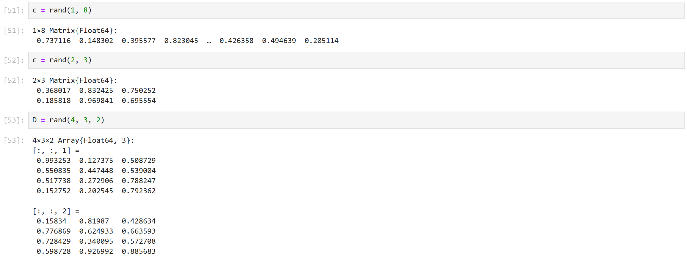{#fig:009 width=70%}

## Массивы

{#fig:010 width=70%}

## Массивы

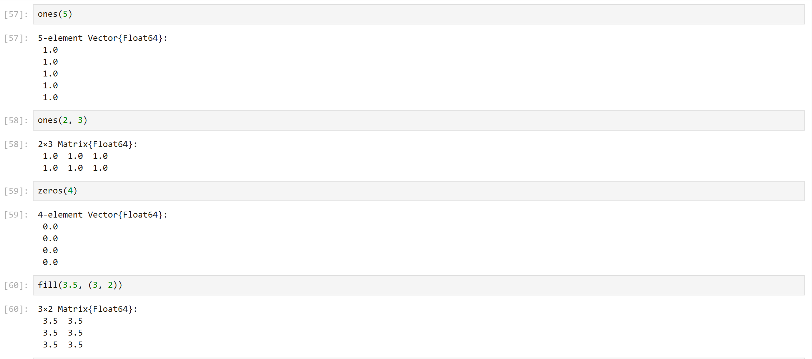{#fig:011 width=70%}

## Массивы

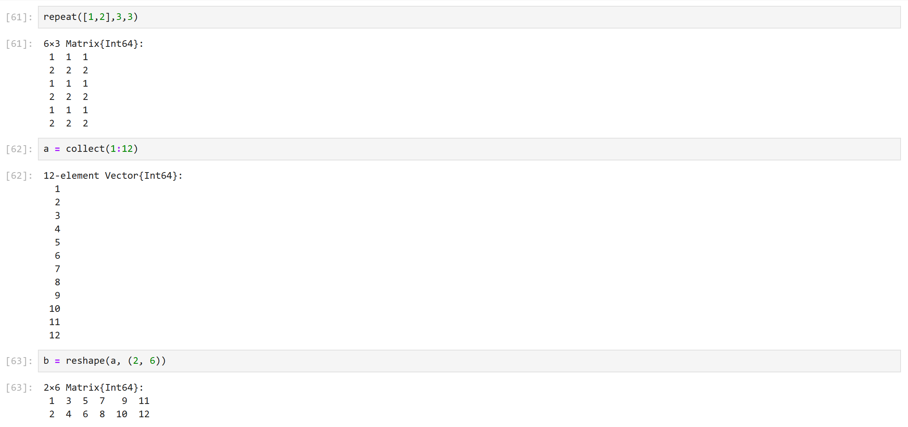{#fig:012 width=70%}

## Массивы

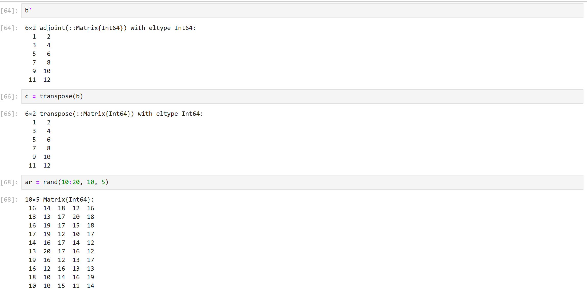{#fig:013 width=70%}

## Массивы

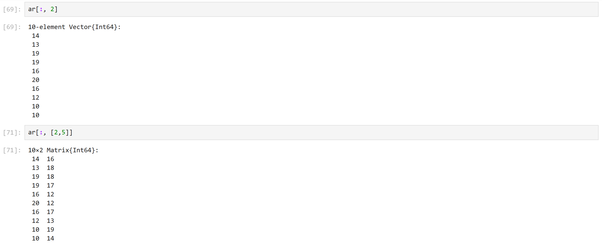{#fig:014 width=70%}

## Массивы

{#fig:015 width=70%}

## Массивы

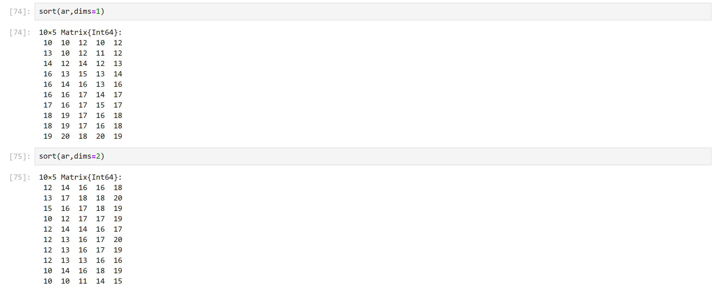{#fig:016 width=70%}

## Задание 1

{#fig:017 width=70%}

## Задание 2

{#fig:018 width=70%}

## Задание 2

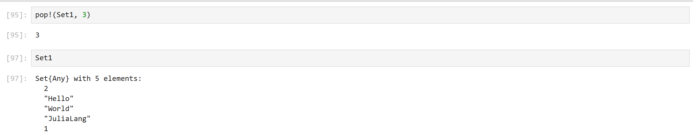{#fig:019 width=70%}

## Задание 3

{#fig:020 width=70%}

## Задание 3

{#fig:021 width=70%}

## Задание 3

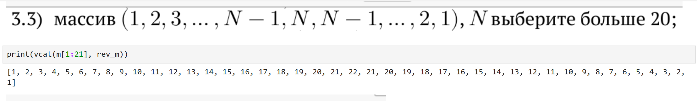{#fig:022 width=70%}

## Задание 3

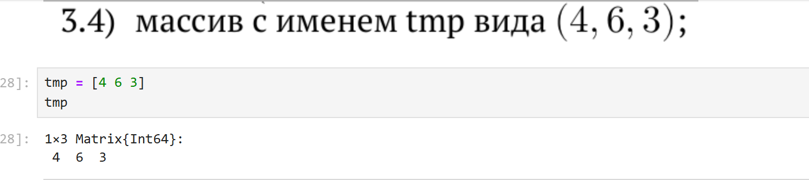{#fig:023 width=70%}

## Задание 3

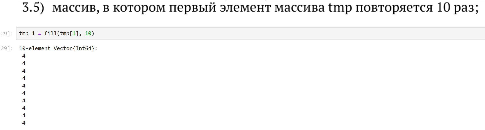{#fig:024 width=70%}

## Задание 3

{#fig:025 width=70%}

## Задание 3

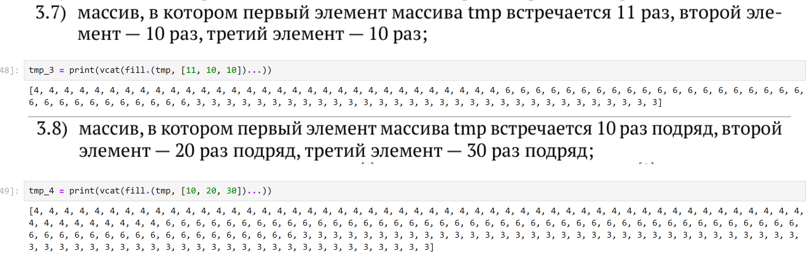{#fig:026 width=70%}

## Задание 3

{#fig:027 width=70%}

## Задание 3

{#fig:028 width=70%}

## Задание 3

{#fig:029 width=70%}

## Задание 3

{#fig:030 width=70%}

## Задание 3

{#fig:031 width=70%}

## Задание 3

{#fig:032 width=70%}

## Задание 3

{#fig:033 width=70%}

## Задание 3

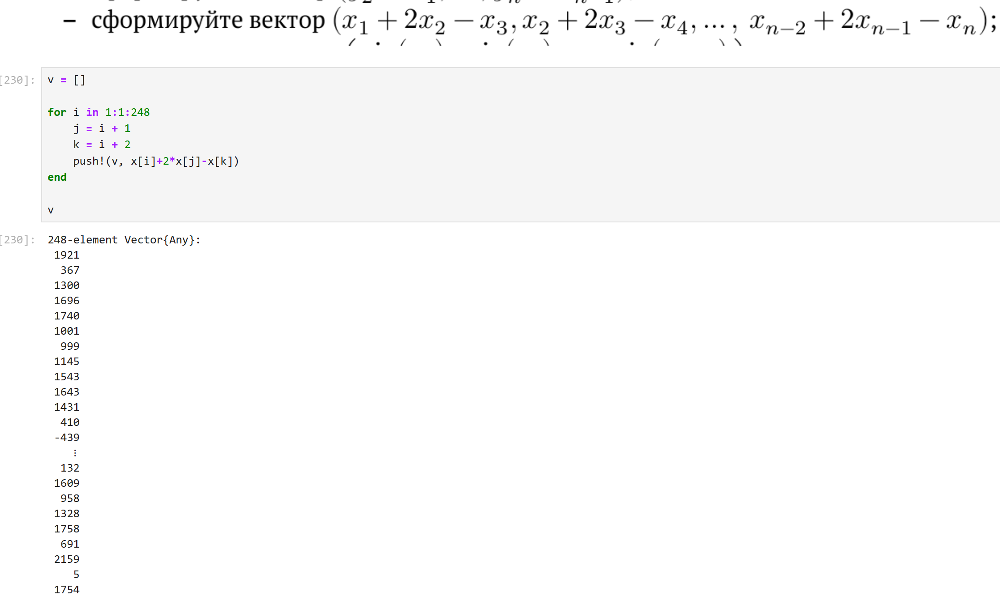{#fig:034 width=70%}

## Задание 3

{#fig:035 width=70%}

## Задание 3

{#fig:036 width=70%}

## Задание 3

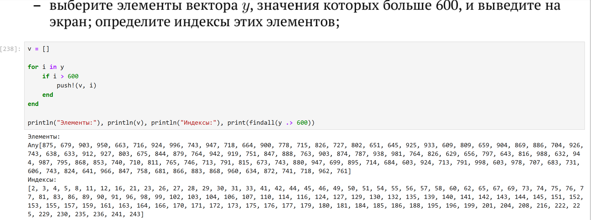{#fig:037 width=70%}

## Задание 3

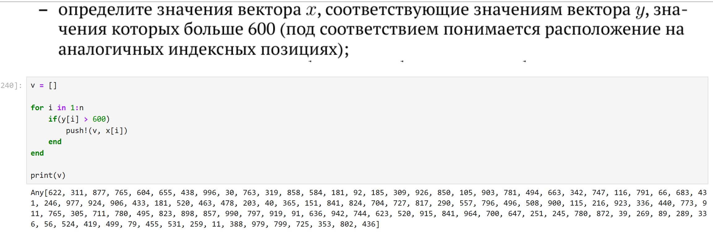{#fig:038 width=70%}

## Задание 3

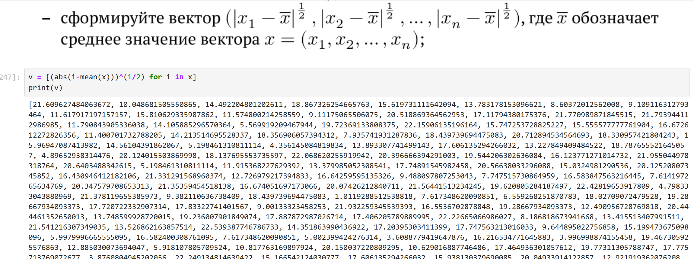{#fig:039 width=70%}

## Задание 3

{#fig:040 width=70%}

## Задание 3

{#fig:041 width=70%}

## Задание 3

{#fig:042 width=70%}

## Задание 4

{#fig:043 width=70%}

## Задание 5

{#fig:044 width=70%}

## Задание 5

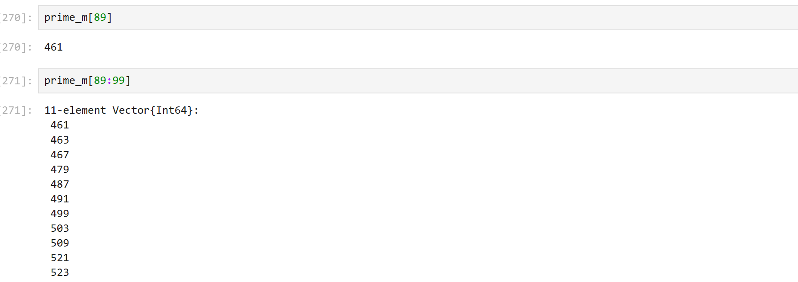{#fig:045 width=70%}

## Задание 6

{#fig:046 width=70%}

## Задание 6

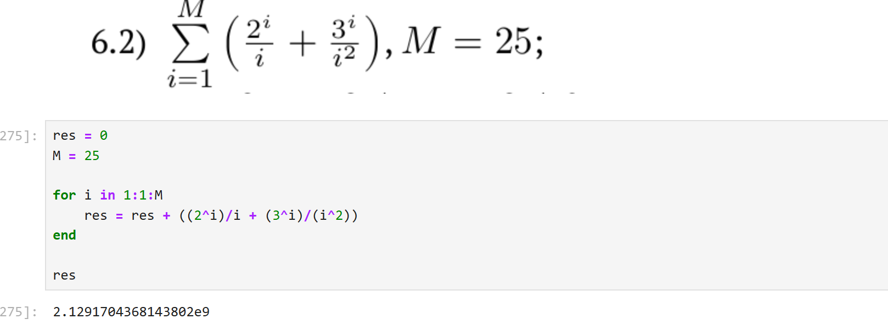{#fig:047 width=70%}

## Задание 6

{#fig:048 width=70%}

## Выводы

В результате выполнения данной лабораторной работы я изучила несколько структур данных, реализованных в Julia, научилась применять их и операции над ними для решения заадач.

## Список литературы

1. JuliaLang [Электронный ресурс]. 2024 JuliaLang.org contributors. URL: https://julialang.org/ (дата обращения: 11.10.2024).
2. Julia 1.11 Documentation [Электронный ресурс]. 2024 JuliaLang.org contributors. URL: https://docs.julialang.org/en/v1/ (дата обращения: 11.10.2024).