---
## Front matter
lang: ru-RU
title: Лабораторная работа №8
subtitle: Оптимизация
author:
  - Доберштейн А. С.
institute:
  - Российский университет дружбы народов, Москва, Россия

## i18n babel
babel-lang: russian
babel-otherlangs: english

## Formatting pdf
toc: false
toc-title: Содержание
slide_level: 2
aspectratio: 169
section-titles: true
theme: metropolis
header-includes:
 - \usetheme{metropolis}
 - \usepackage{fontspec}
 - \usepackage{polyglossia}
 - \setdefaultlanguage{russian}
 - \setmainfont{FreeSerif}
 - \setsansfont{FreeSerif}
 - \setmonofont{FreeSerif}
 - \usepackage{amsmath}
 - \usepackage{amssymb}
---

# Информация

## Докладчик

:::::::::::::: {.columns align=center}
::: {.column width="70%"}

  * Доберштейн Алина Сергеевна
  * НФИбд-02-22
  * Российский университет дружбы народов

:::

::::::::::::::

## Цель работы

Основная цель работы — освоить пакеты Julia для решения задач оптимизации.

## Выполнение лабораторной работы

Повторим примеры из лабораторной работы.

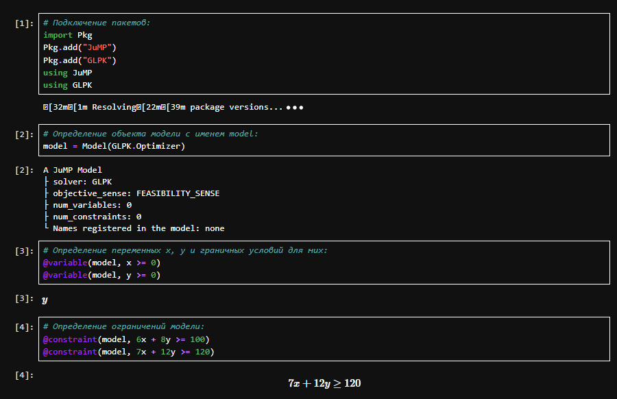{#fig:001 width=40%}

## Выполнение лабораторной работы

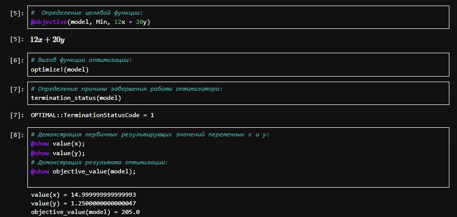{#fig:002 width=40%}

## Выполнение лабораторной работы

{#fig:003 width=40%}

## Выполнение лабораторной работы

{#fig:004 width=40%}

## Выполнение лабораторной работы

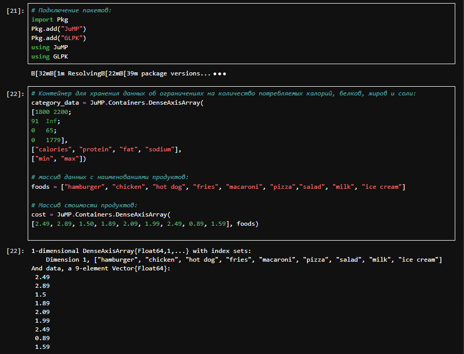{#fig:005 width=40%}

## Выполнение лабораторной работы

{#fig:006 width=40%}

## Выполнение лабораторной работы

{#fig:007 width=40%}

## Выполнение лабораторной работы

{#fig:008 width=40%}

## Выполнение лабораторной работы

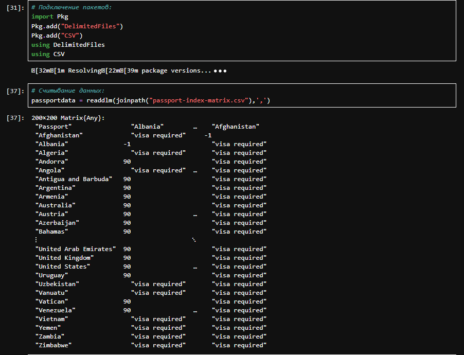{#fig:009 width=40%}

## Выполнение лабораторной работы

{#fig:010 width=40%}

## Выполнение лабораторной работы

{#fig:011 width=40%}

## Выполнение лабораторной работы

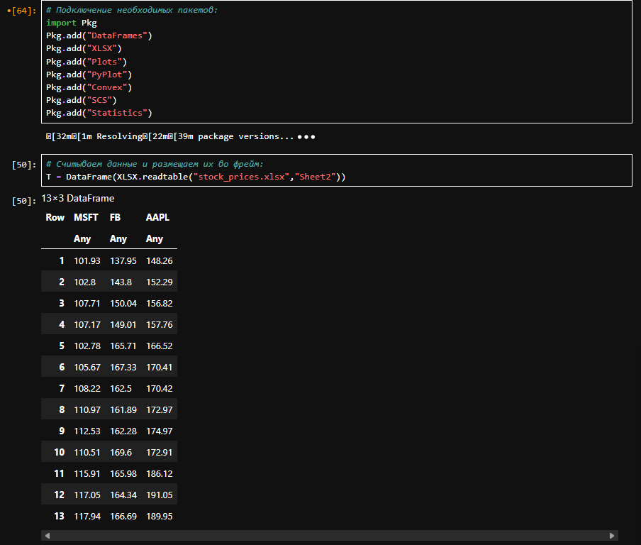{#fig:012 width=40%}

## Выполнение лабораторной работы

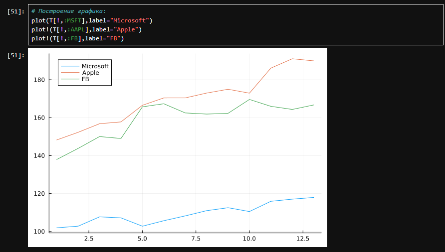{#fig:013 width=40%}

## Выполнение лабораторной работы

{#fig:014 width=40%}

## Выполнение лабораторной работы

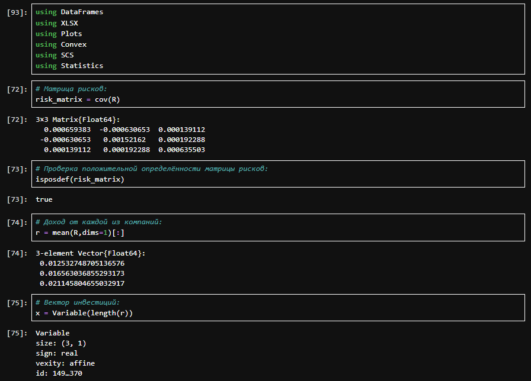{#fig:015 width=40%}

## Выполнение лабораторной работы

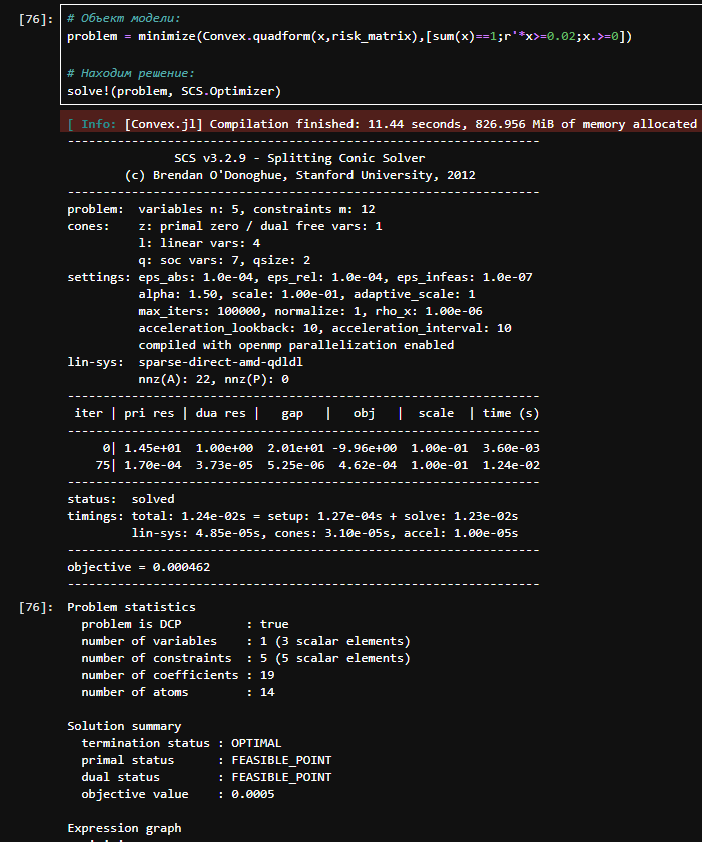{#fig:016 width=40%}

## Выполнение лабораторной работы

{#fig:017 width=40%}

## Выполнение лабораторной работы

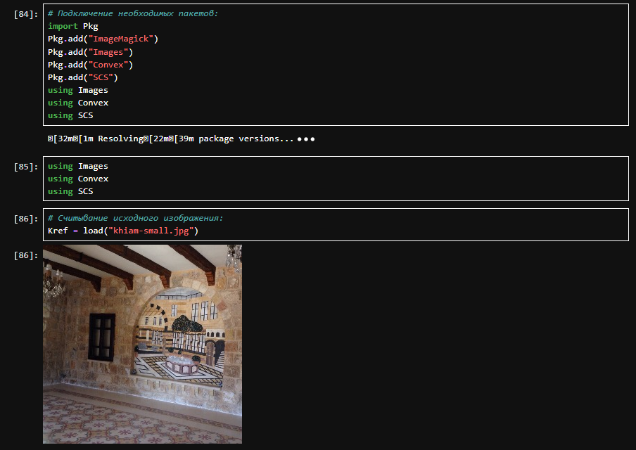{#fig:018 width=40%}

## Выполнение лабораторной работы

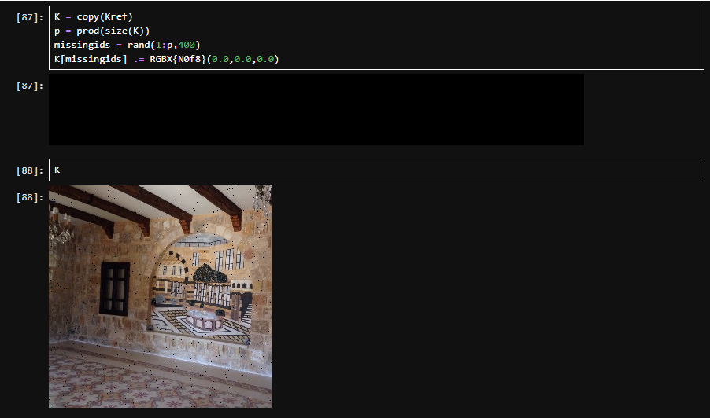{#fig:019 width=40%}

## Выполнение лабораторной работы

{#fig:020 width=40%}

## Выполнение лабораторной работы

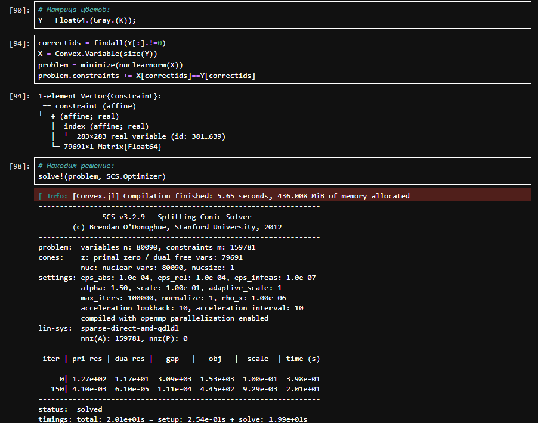{#fig:021 width=40%}

## Выполнение лабораторной работы

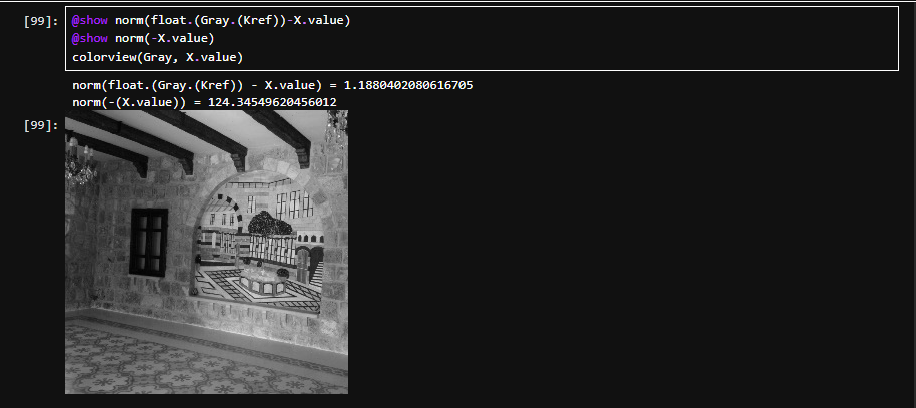{#fig:022 width=40%}

## Выполнение лабораторной работы

{#fig:023 width=40%}

## Выполнение лабораторной работы

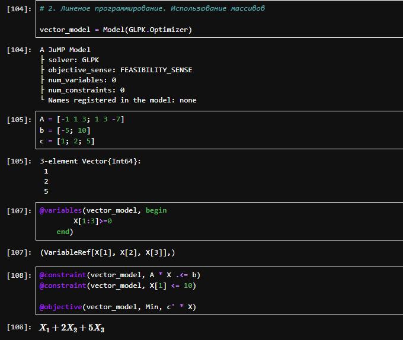{#fig:024 width=40%}

## Выполнение лабораторной работы

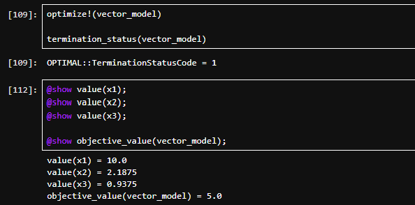{#fig:025 width=40%}

## Выполнение лабораторной работы

{#fig:026 width=40%}

## Выполнение лабораторной работы

{#fig:027 width=40%}

## Выполнение лабораторной работы

{#fig:028 width=40%}

## Выполнение лабораторной работы

{#fig:029 width=40%}

## Выполнение лабораторной работы

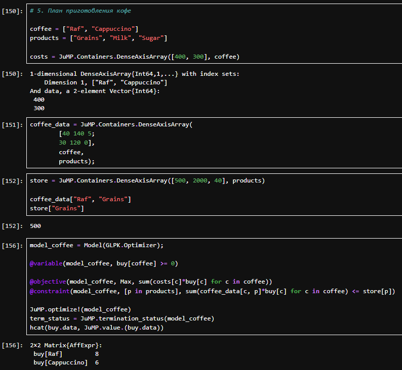{#fig:030 width=40%}

## Выводы

В результате выполнения работы были освоены пакеты Julia для решения задач оптимизации.
